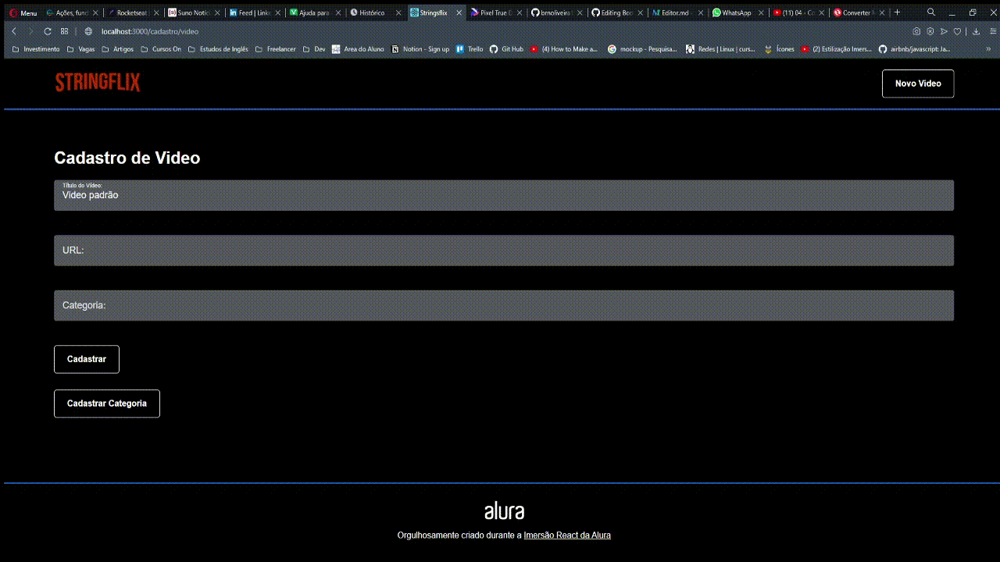

# StringsFlix 🎻
--------------

Projeto desenvolvido durante o evento Imersão React da Alura.





Projeto desenvolvido junto aos professores da Alura no evento imersão React. O projeto foi adaptado conforme solicitado no evento e o tema que escolhi foi relacionado a música, mais especificamente aos instrumentos de cordas.
## Tecnologia Utilizada:

 - React

## Como Executar ?
- Instalação:

Você vai precisar ter o **[Node](https://nodejs.org/en/ "Node")** instalado em seu computador.

```bash
npm install
```
ou
```bash
yarn install
```
- Executar:

```bash
npm dev
```
ou
```bash
yarn dev
```
